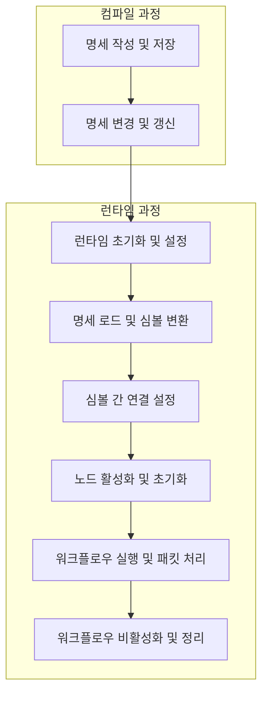
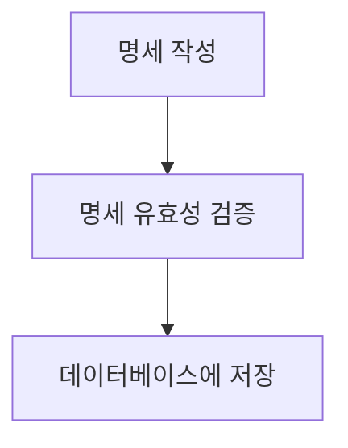
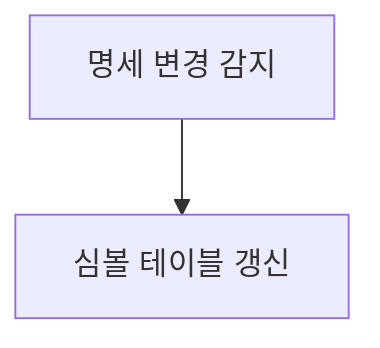
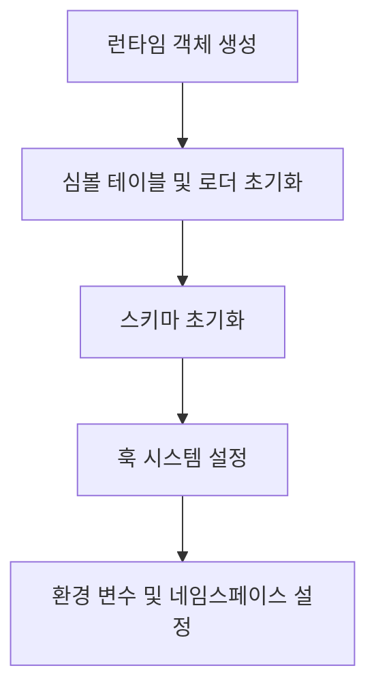
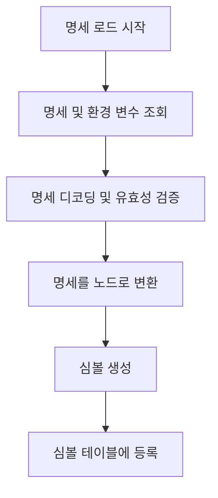
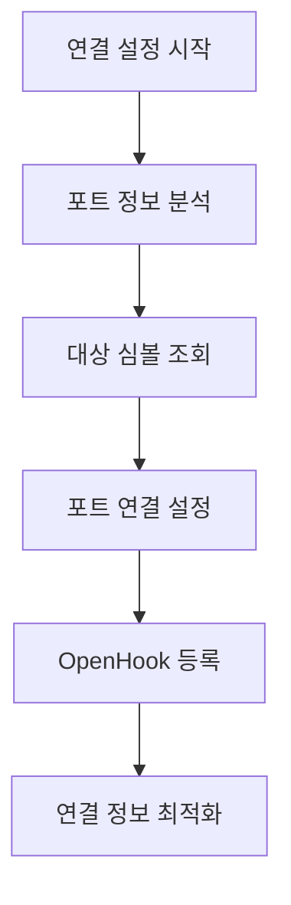
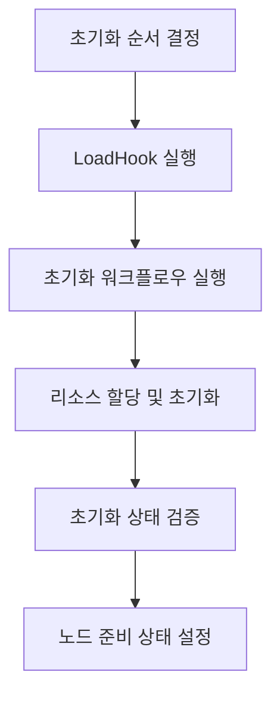
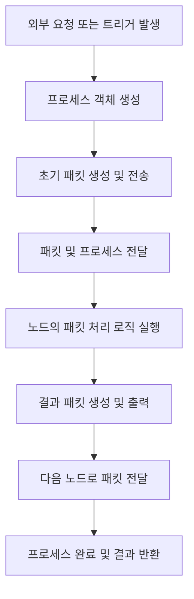
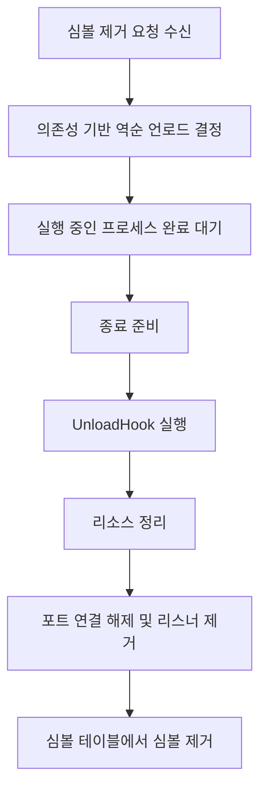

# 플로우차트

이 가이드는 워크플로우의 컴파일 과정과 런타임 과정을 상세히 설명합니다. 시스템의 전체적인 구조와 아키텍처에 대한 설명은 [아키텍처 문서](./architecture_kr.md)를, 핵심 개념에 대한 자세한 설명은 [핵심 개념 문서](./key_concepts_kr.md)를 참조하기 바랍니다.

## 워크플로우 개요

워크플로우는 **노드 간 데이터 흐름을 형성하는 방향성 그래프**입니다. 워크플로우의 라이프사이클은 크게 컴파일 과정과 런타임 과정으로 나뉩니다.

## 전체 워크플로우 시퀀스

워크플로우의 컴파일부터 실행, 종료까지의 전체 흐름은 다음과 같습니다:



각 워크플로우는 특정 **네임스페이스** 내에서 실행되며, 다른 네임스페이스의 노드와는 격리됩니다.

> **참고**: 이 문서에서 사용되는 모든 핵심 용어에 대한 자세한 설명은 [핵심 개념 문서](./key_concepts_kr.md)에서 확인할 수 있습니다.

## 1. 워크플로우 컴파일 과정

명세 작성부터 유효성 검증, 데이터베이스 저장을 통해 실행 가능한 형태로 준비하는 과정을 설명합니다. 

### 1.1 명세 작성 및 저장



1. **명세 작성**
   * 노드의 ID, 네임스페이스, 이름, 종류, 포트 정보 등을 포함하는 명세를 작성합니다.
   * 예시:
     ```yaml
     id: "node-1"
     kind: "http"
     namespace: "default"
     name: "api-call"
     ports:
       out:
         - name: "node-2"
           port: "in"
     ```

2. **명세 유효성 검증**
   * 작성된 명세가 스키마에 부합하는지 검증합니다.
   * 포트 연결 정보의 일관성을 확인합니다.

3. **데이터베이스에 저장**
   * 검증된 명세는 `spec.Store.Store(ctx, spec)` 메서드를 통해 데이터베이스에 저장됩니다.
   * 저장된 명세는 이벤트를 통해 런타임에 변경 사항을 알립니다.

### 1.2 명세 변경 및 갱신

런타임이 실행된 이후에도 명세는 변경될 수 있으며, 이러한 변경 사항은 런타임에 실시간으로 반영됩니다.



1. **명세 변경 감지**
   * 런타임은 `Runtime.Watch(ctx)` 메서드를 통해 명세 변경 이벤트를 구독합니다.
   * 데이터베이스는 명세 변경 시 이벤트를 발행합니다.

2. **심볼 테이블 갱신**
   * 런타임은 `Runtime.Reconcile(ctx)` 메서드를 통해 변경된 명세를 감지하고 심볼 테이블을 갱신합니다.
   * 변경된 명세에 따라 새 노드를 생성하거나 기존 노드를 업데이트하고 연결을 재구성합니다.

## 2. 워크플로우 런타임 과정

데이터베이스에 저장된 명세를 로드하여 실행 가능한 심볼로 변환하고, 노드 간 연결을 구성한 후 패킷 기반 데이터 처리 흐름을 실행하는 전체 과정을 설명합니다.

### 2.1 런타임 초기화 및 설정



1. **런타임 객체 생성**
   * `Runtime.New(config)` 메서드를 통해 런타임 객체를 생성합니다.
   * 설정(config)에는 기본 실행 환경과 관련된 설정이 포함됩니다.

2. **심볼 테이블 및 로더 초기화**
   * 심볼을 저장하고 관리할 심볼 테이블을 생성합니다.
   * 명세를 로드하고 변환할 로더를 초기화합니다.

3. **스키마 초기화**
   * 노드 유형별 코덱을 등록합니다.
   * 각 노드 종류에 맞는 변환 규칙을 설정합니다.

4. **훅 시스템 설정**
   * 심볼 생명주기 관리를 위한 훅을 등록합니다.
   * `LoadHook`: 심볼 로드 시 실행되는 작업 등록
   * `UnloadHook`: 심볼 언로드 시 실행되는 작업 등록

5. **환경 변수 및 네임스페이스 설정**
   * 런타임의 실행 환경과 컨텍스트를 구성합니다.
   * 명세를 로드할 네임스페이스를 지정합니다.
   * 환경 변수를 설정하여 노드에서 사용할 수 있도록 합니다.

### 2.2 명세 로드 및 심볼 변환



1. **명세 로드 시작**
   * `Runtime.Load(ctx)` 메서드를 호출하여 로딩 프로세스를 시작합니다.
   * 로딩 컨텍스트가 초기화되고 로드 작업이 준비됩니다.

2. **명세 및 환경 변수 조회**
   * 로더는 데이터베이스에서 네임스페이스에 해당하는 명세를 조회합니다.
   * 환경 변수와 값도 함께 로드하여 명세에서 참조되는 변수를 해석할 수 있게 합니다.

3. **명세 디코딩 및 유효성 검증**
   * 로드된 명세 데이터를 구조체로 디코딩합니다.
   * 명세의 유효성을 검증하고 필수 필드가 올바르게 설정되었는지 확인합니다.
   * 환경 변수를 적용하여 템플릿 값을 실제 값으로 대체합니다.

4. **명세를 노드로 변환**
   * 스키마의 코덱을 사용해 명세를 실행 가능한 노드로 변환합니다.
   * 노드 종류에 따라 적절한 코덱이 선택됩니다.

5. **심볼 생성**
   * 변환된 노드를 심볼로 래핑합니다.
   * 심볼은 노드와 원본 명세 정보를 모두 포함합니다.

6. **심볼 테이블에 등록**
   * 생성된 심볼을 심볼 테이블에 등록합니다.
   * 심볼은 ID와 이름을 기준으로 인덱싱되어 빠르게 조회할 수 있습니다.

### 2.3 심볼 간 연결 설정



1. **연결 설정 시작**
   * `Runtime.Reconcile(ctx)` 메서드를 호출하여 심볼 간 연결 설정 프로세스를 시작합니다.

2. **포트 정보 분석**
   * 심볼 테이블의 모든 심볼에 대해 명세의 ports 섹션을 분석합니다.
   * 각 출력 포트와 연결해야 할 대상 노드 및 포트 정보를 식별합니다.
   * 예시 명세 형태:
     ```yaml
     ports:
       out:
         - name: "target-node"
           port: "in"
     ```

3. **대상 심볼 조회**
   * 연결할 대상 노드의 이름과 네임스페이스를 이용해 심볼 테이블에서 대상 심볼을 조회합니다.
   * 심볼 테이블은 이름과 네임스페이스를 기반으로 심볼 ID를 찾고, 해당 ID로 심볼을 검색합니다.
   * 존재하지 않는 심볼 참조는 오류로 처리됩니다.

4. **포트 연결 설정**
   * 소스 노드의 출력 포트(`Out`)와 대상 노드의 입력 포트(`In`)를 연결합니다.
   * 심볼 테이블의 `links` 메서드를 통해 연결 정보를 등록합니다.
   * 이 연결 정보는 런타임이 패킷을 올바른 대상으로 라우팅하는 데 사용됩니다.

5. **OpenHook 등록**
   * 각 포트에 OpenHook을 등록하여 프로세스 생성 시 포트 활성화를 준비합니다.
   * OpenHook은 포트가 열릴 때 Writer/Reader를 생성하고 패킷 처리 준비를 담당합니다.

6. **연결 정보 최적화**
   * 연결 설정이 완료된 후 성능 최적화를 위해 연결 정보를 캐싱합니다.
   * 자주 사용되는 경로를 빠르게 조회할 수 있도록 인덱싱합니다.
   * 순환 참조 및 유효하지 않은 연결에 대한 추가 검증을 수행합니다.

### 2.4 노드 활성화 및 초기화



1. **초기화 순서 결정**
   * 심볼 테이블은 노드 간 연결 관계를 분석하여 초기화 순서를 결정합니다.
   * 의존하는 노드가 먼저 초기화되도록 위상 정렬(Topological Sort) 알고리즘이 적용됩니다.
   * 이를 통해 노드 간 의존성을 고려한 안전한 초기화 순서가 보장됩니다.

2. **LoadHook 실행**
   * 결정된 순서대로 각 심볼에 대해 등록된 LoadHook을 순차적으로 실행합니다.
   * LoadHook은 노드 초기화 전 준비 작업을 수행합니다.
   * 초기화 순서는 의존성에 따라 결정되어, 의존하는 노드가 있는 경우 해당 노드가 먼저 초기화됩니다.

3. **초기화 워크플로우 실행**
   * 각 노드는 `node.PortInit` 이름의 특수 포트를 통해 초기화 로직을 실행합니다.
   * 특수 포트는 코드에서 상수로 정의되어 있으며, 특정 생명주기 이벤트를 처리합니다:
     - `node.PortInit`: 노드가 처음 로드될 때 초기화 작업 수행
     - `node.PortBegin`: 초기화 후 노드가 활성화될 때 호출
     - `node.PortTerm`: 노드가 언로드될 때 준비 작업 수행
     - `node.PortFinal`: 노드 종료 시 최종 정리 작업 수행
   * 심볼 테이블은 `exec` 메서드를 통해 심볼의 특수 포트로 초기화 워크플로우를 실행합니다.
   * 새로운 프로세스를 생성하여 초기화 워크플로우를 실행합니다.
   * 초기화 워크플로우는 다음과 같은 작업을 수행할 수 있습니다:
     - 데이터베이스 연결 설정
     - 외부 시스템 연결 초기화
     - 리소스 할당 및 구성

4. **리소스 할당 및 초기화**
   * 각 노드는 필요한 시스템 리소스를 할당받고 초기화합니다.
   * 이는 노드 종류에 따라 달라질 수 있습니다:
     - 네트워크 포트 오픈 (리스너 노드)
     - 파일 핸들러 초기화 (파일 I/O 노드)
     - 메모리 버퍼 할당 (데이터 처리 노드)

5. **초기화 상태 검증**
   * 모든 노드의 초기화 상태를 검증하고 오류가 발생한 경우 처리합니다.
   * 초기화에 실패한 노드는 비활성화하거나 오류 상태로 표시합니다.
   * 심각한 오류가 발생한 경우 의존성 역순으로 이미 초기화된 노드들의 정리 작업이 수행됩니다.

6. **노드 준비 상태 설정**
   * 초기화가 완료된 후 `node.PortBegin` 포트를 통해 시작 워크플로우를 실행합니다.
   * 성공적으로 초기화된 노드를 준비 상태로 설정합니다.
   * 이제 노드는 패킷을 수신하고 처리할 준비가 완료됩니다.

> **참고**: 노드 간 의존성이 초기화 순서를 결정하는 핵심입니다. 의존하는 노드가 먼저 초기화되고 나중에 정리됨으로써 워크플로우의 안정성이 보장됩니다.

### 2.5 워크플로우 실행 및 패킷 처리



1. **외부 요청 또는 트리거 발생**
   * 워크플로우 실행은 API 호출, 스케줄러, 이벤트 트리거 등 외부 요청에 의해 시작됩니다.
   * 예: REST API, 시간 기반 트리거, 파일 시스템 이벤트 등
   * 이 요청은 워크플로우의 시작점이 되는 특정 노드를 대상으로 합니다.

2. **프로세스 객체 생성**
   * 워크플로우 실행을 위한 새로운 프로세스 객체를 생성합니다.
   * 이 프로세스 객체는 고유 ID를 가지며 워크플로우 실행 컨텍스트를 제공합니다.
   * 프로세스 객체는 다음과 같은 정보를 포함합니다:
     - 고유 식별자 (UUID)
     - 시작 시간
     - 상태 정보
     - 데이터 저장소 (key-value)
     - 오류 정보
     - 완료 채널 (done)

3. **초기 패킷 생성 및 전송**
   * 초기 데이터를 포함한 패킷을 생성합니다.
   * 패킷은 다음과 같은 정보를 포함합니다:
     - 데이터 페이로드 (interface{})
     - 메타데이터 (headers)
     - 소스 정보 (출발 노드/포트)
     - 타겟 정보 (목적지 노드/포트)
   * 생성된 패킷을 시작 노드의 입력 포트로 전송합니다.

4. **패킷 및 프로세스 전달**
   * 입력 포트는 패킷과 프로세스를 등록된 리스너에게 전달합니다.
   * 포트에 등록된 모든 리스너가 패킷을 수신합니다.
   * OpenHook이 실행되어 포트가 열리고, 패킷이 포트를 통과하게 됩니다.

5. **노드의 패킷 처리 로직 실행**
   * 노드는 입력 포트로 수신한 패킷을 처리하는 로직을 실행합니다.
   * 각 노드는 자신의 유형에 따라 다양한 처리를 수행합니다:
     - 데이터 변환 (Transform 노드)
     - 조건부 분기 (Switch, If 노드)
     - 외부 시스템과 통신 (HTTP, DB 노드)
     - 데이터 집계 또는 필터링 (Aggregate, Filter 노드)
   * 프로세스는 노드 간에 상태를 유지하며 전달됩니다.

6. **결과 패킷 생성 및 출력**
   * 노드 처리 결과에 기반하여 새로운 패킷을 생성합니다.
   * 생성된 패킷을 출력 포트로 전송합니다.
   * 하나의 입력 패킷이 여러 출력 패킷을 생성할 수 있습니다 (예: Split 노드).

7. **다음 노드로 패킷 전달**
   * 출력 포트는 패킷을 연결된 다음 노드의 입력 포트로 전달합니다.
   * 이 과정은 연결 설정 단계에서 구성된 포트 간 연결에 따라 이루어집니다.
   * 패킷은 워크플로우 그래프를 따라 FIFO(First In, First Out) 방식으로 순차적으로 처리됩니다.

8. **프로세스 완료 및 결과 반환**
   * 모든 노드가 패킷 처리를 완료하면 프로세스가 완료됩니다.
   * 최종 결과는 워크플로우의 마지막 노드에서 반환되거나 특정 출력 포트로 전송됩니다.
   * 프로세스 완료 시 `process.Exit()` 호출을 통해 정리 작업이 수행됩니다.
   * 등록된 종료 훅(ExitHook)이 실행되어 리소스 정리 및 최종 처리가 이루어집니다.

### 2.6 워크플로우 비활성화 및 정리



1. **심볼 제거 요청 수신**
   * 런타임은 심볼 제거 요청(Unload)을 받아 워크플로우 비활성화 프로세스를 시작합니다.
   * 제거 요청은 다음과 같은 이유로 발생할 수 있습니다:
     - 사용자 요청 (명세 삭제 또는 업데이트)
     - 시스템 종료 (Runtime.Close())
     - 오류 복구 과정 (심볼 재로딩)

2. **의존성 기반 역순 언로드 결정**
   * 초기화와 반대 순서로 심볼을 언로드하기 위해 의존성 그래프를 역순으로 탐색합니다.
   * 이를 통해 의존하는 노드가 먼저 언로드되어 안전한 정리가 가능합니다.

3. **실행 중인 프로세스 완료 대기**
   * 런타임은 제거할 심볼과 관련된 모든 실행 중인 프로세스가 완료될 때까지 대기합니다.
   * 이는 안전한 제거를 위해 필수적인 단계입니다.
   * 일정 시간 후에도 완료되지 않으면 타임아웃을 통해 강제 종료할 수 있습니다.

4. **종료 준비**
   * 각 노드의 `node.PortTerm` 포트를 호출하여 종료 준비를 수행합니다.
   * 심볼 테이블은 `exec` 메서드를 통해 심볼의 종료 준비 작업을 수행합니다.
   * 외부 연결 종료, 임시 데이터 저장 등 정리 작업이 이루어집니다.

5. **UnloadHook 실행**
   * 각 심볼에 대해 등록된 UnloadHook을 역순으로 실행합니다.
   * UnloadHook은 노드 종료 전 정리 작업을 수행합니다.

6. **리소스 정리**
   * 각 노드의 `node.PortFinal` 포트를 호출하여 최종 정리 작업을 수행합니다.
   * 노드는 할당된 시스템 리소스를 해제합니다:
     - 데이터베이스 연결 종료
     - 네트워크 소켓 닫기
     - 파일 핸들러 정리
     - 타이머 및 고루틴 종료

7. **포트 연결 해제 및 리스너 제거**
   * 모든 포트 연결을 해제하고 등록된 리스너를 제거합니다.
   * 입력 및 출력 포트의 모든 연결 정보가 삭제됩니다.
   * 다른 심볼의 포트에서도 해당 심볼과의 연결 정보가 제거됩니다.

8. **심볼 테이블에서 심볼 제거**
   * 심볼 테이블에서 해당 심볼을 완전히 제거합니다.
   * 심볼 ID와 이름으로 더 이상 심볼을 찾을 수 없게 됩니다.
   * 관련 메모리 리소스가 해제되고 최종 상태가 로깅됩니다. 