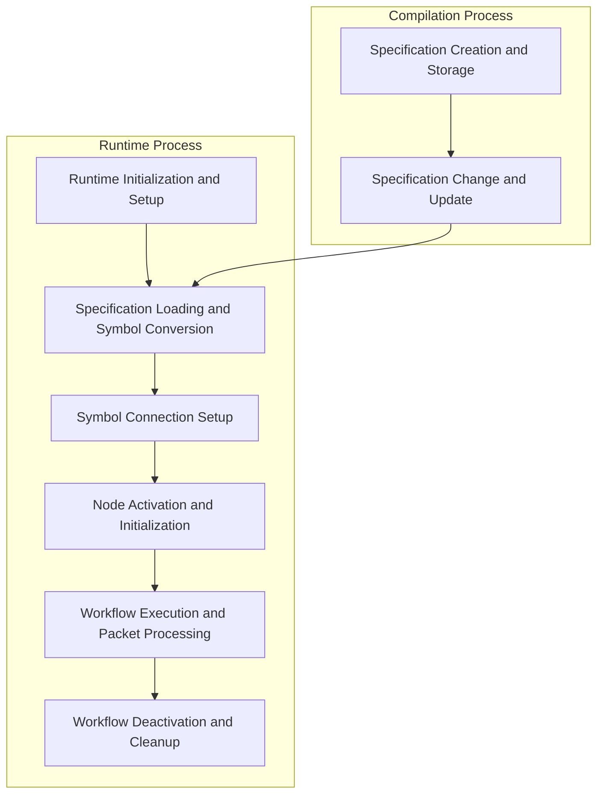
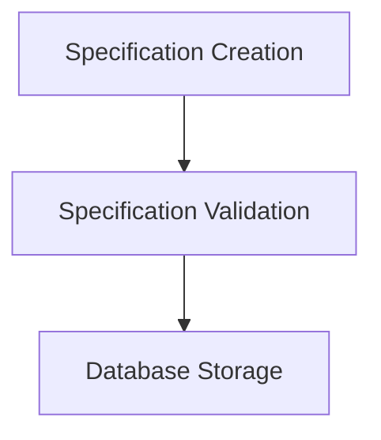
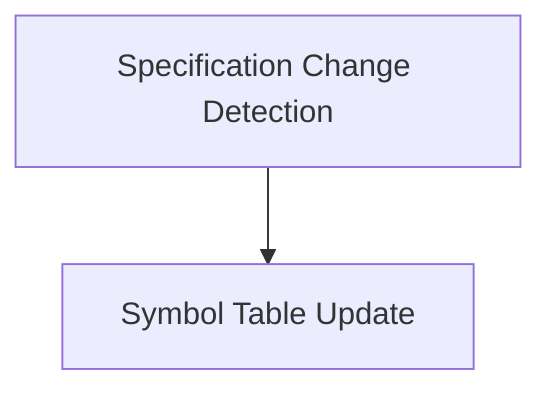
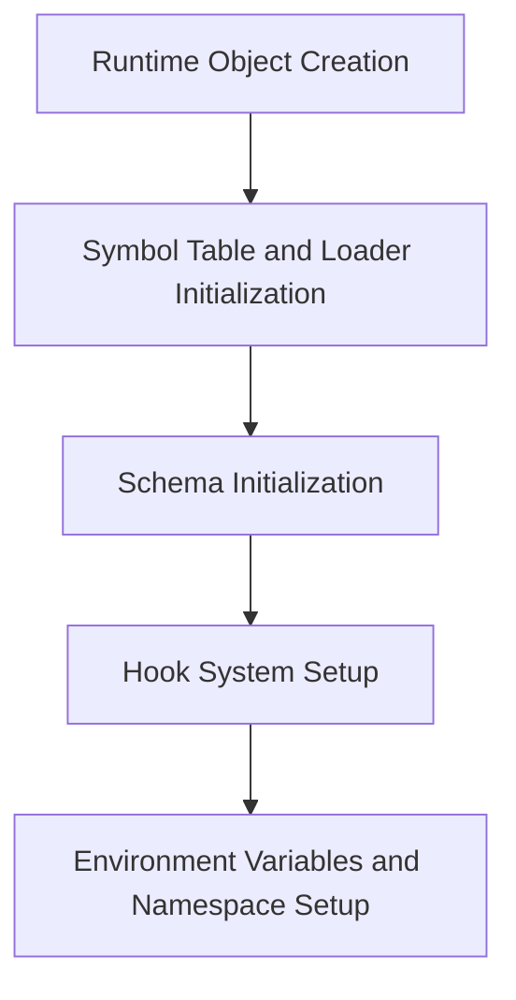
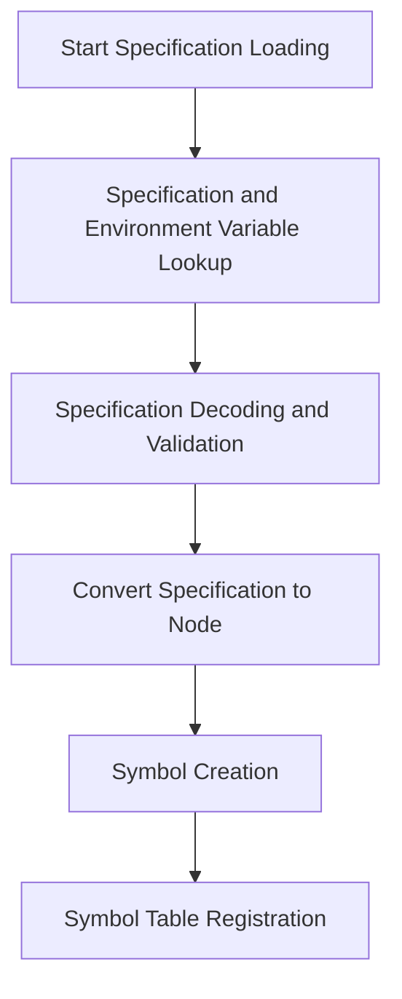
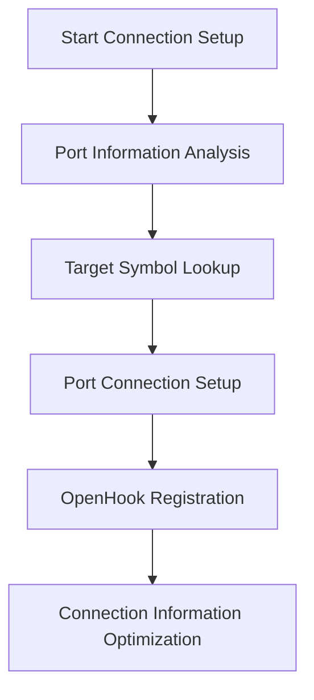
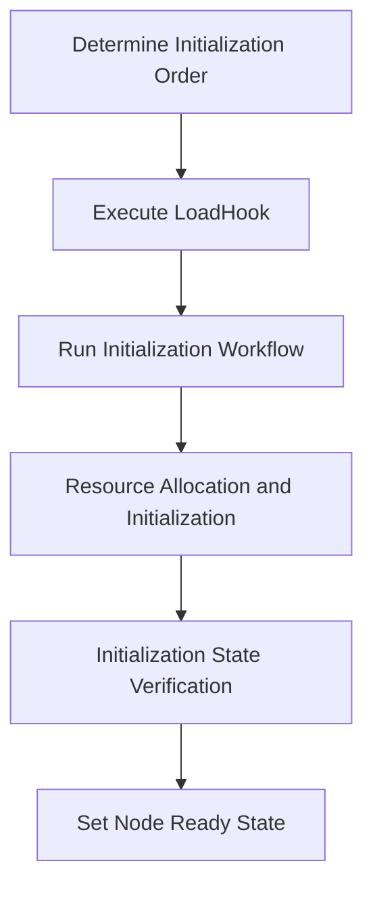
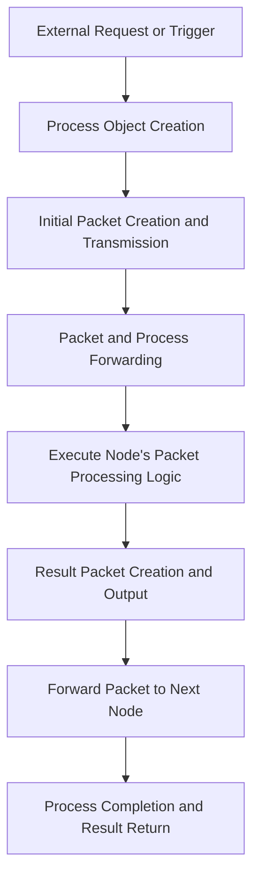
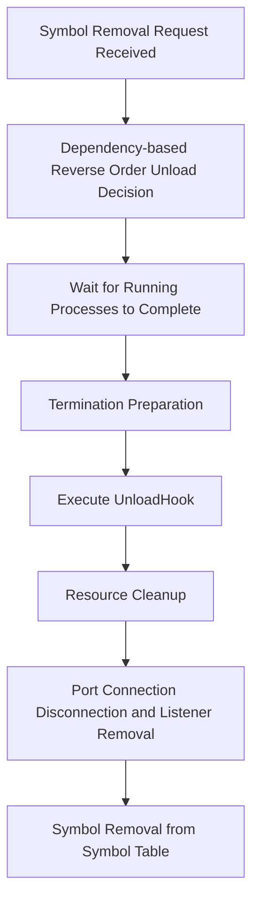

# 🔗 Flowchart

This guide provides a detailed explanation of the workflow compilation and runtime processes. For information on the overall structure and architecture of the system, refer to the [Architecture Document](./architecture.md), and for a detailed explanation of key concepts, refer to the [Key Concepts Document](./key_concepts.md).

## Workflow Overview

A workflow is a **directed graph that forms a data flow between nodes**. The lifecycle of a workflow is divided into two main processes: compilation and runtime.

## Complete Workflow Sequence

The complete flow from compilation to execution and termination of a workflow is as follows:



Each workflow runs within a specific **namespace** and is isolated from nodes in other namespaces.

## 1. Workflow Compilation Process

This section explains the process from specification creation to validation and database storage, preparing the workflow for execution.

### 1.1 Specification Creation and Storage



1. **Specification Creation**
   * Create a specification that includes node ID, namespace, name, kind, port information, etc.
   * Example:
     ```yaml
     id: "node-1"
     kind: "http"
     namespace: "default"
     name: "api-call"
     ports:
       out:
         - name: "node-2"
           port: "in"
     ```

2. **Specification Validation**
   * Validate that the specification complies with the schema.
   * Check the consistency of port connection information.

3. **Database Storage**
   * Validated specifications are stored in the database through the `spec.Store.Store(ctx, spec)` method.
   * Stored specifications notify the runtime of changes through events.

### 1.2 Specification Change and Update

Specifications can be changed even after the runtime is running, and these changes are reflected in real-time.



1. **Specification Change Detection**
   * The runtime subscribes to specification change events via the `Runtime.Watch(ctx)` method.
   * The database publishes events when specifications change.

2. **Symbol Table Update**
   * The runtime detects changed specifications and updates the symbol table through the `Runtime.Reconcile(ctx)` method.
   * Based on changed specifications, new nodes are created or existing nodes are updated, and connections are reconfigured.

## 2. Workflow Runtime Process

This section explains the entire process of loading database-stored specifications and converting them into executable symbols, configuring connections between nodes, and executing packet-based data processing flows.

### 2.1 Runtime Initialization and Setup



1. **Runtime Object Creation**
   * Create a runtime object via the `Runtime.New(config)` method.
   * The configuration includes settings related to the basic execution environment.

2. **Symbol Table and Loader Initialization**
   * Create a symbol table to store and manage symbols.
   * Initialize the loader to load and transform specifications.

3. **Schema Initialization**
   * Register codecs for each node type.
   * Set transformation rules for each node kind.

4. **Hook System Setup**
   * Register hooks for managing symbol lifecycles.
   * `LoadHook`: Register tasks to be executed when a symbol is loaded.
   * `UnloadHook`: Register tasks to be executed when a symbol is unloaded.

5. **Environment Variables and Namespace Setup**
   * Configure the runtime's execution environment and context.
   * Specify the namespace for loading specifications.
   * Set environment variables for use in nodes.

### 2.2 Specification Loading and Symbol Conversion



1. **Start Specification Loading**
   * Call the `Runtime.Load(ctx)` method to start the loading process.
   * The loading context is initialized and loading tasks are prepared.

2. **Specification and Environment Variable Lookup**
   * The loader queries the database for specifications corresponding to the namespace.
   * Environment variables and values are also loaded to interpret variables referenced in the specification.

3. **Specification Decoding and Validation**
   * Decode loaded specification data into structures.
   * Validate the specification and ensure that required fields are correctly set.
   * Apply environment variables to replace template values with actual values.

4. **Convert Specification to Node**
   * Use the schema's codec to convert the specification into an executable node.
   * The appropriate codec is selected according to the node kind.

5. **Symbol Creation**
   * Wrap the converted node as a symbol.
   * The symbol includes both the node and the original specification information.

6. **Symbol Table Registration**
   * Register the created symbol in the symbol table.
   * Symbols are indexed by ID and name for quick lookup.

### 2.3 Symbol Connection Setup



1. **Start Connection Setup**
   * Call the `Runtime.Reconcile(ctx)` method to start the symbol connection setup process.

2. **Port Information Analysis**
   * Analyze the ports section of the specification for all symbols in the symbol table.
   * Identify each output port and its target node and port information.
   * Example specification format:
     ```yaml
     ports:
       out:
         - name: "target-node"
           port: "in"
     ```

3. **Target Symbol Lookup**
   * Look up the target symbol in the symbol table using the name and namespace of the node to connect to.
   * The symbol table finds the symbol ID based on name and namespace, then searches for the symbol with that ID.
   * Non-existent symbol references are treated as errors.

4. **Port Connection Setup**
   * Connect the source node's output port (`Out`) to the target node's input port (`In`).
   * Register connection information through the `links()` method of the symbol table.
   * This connection information is used by the runtime to route packets to the correct destination.

5. **OpenHook Registration**
   * Register OpenHook for each port to prepare port activation when a process is created.
   * OpenHook is responsible for creating Writers/Readers and preparing packet processing when a port is opened.

6. **Connection Information Optimization**
   * Cache connection information for performance optimization after connection setup is complete.
   * Index frequently used paths for quick lookup.
   * Perform additional validation for circular references and invalid connections.

### 2.4 Node Activation and Initialization



1. **Determine Initialization Order**
   * The symbol table analyzes the connection relationships between nodes to determine the initialization order.
   * A topological sort algorithm is applied so that dependent nodes are initialized first.
   * This ensures a safe initialization order considering node dependencies.

2. **Execute LoadHook**
   * Execute registered LoadHooks sequentially for each symbol in the determined order.
   * LoadHook performs preparation work before node initialization.
   * The initialization order is determined by dependencies; if there are dependent nodes, those nodes are initialized first.

3. **Run Initialization Workflow**
   * Each node executes initialization logic through a special port named `node.PortInit`.
   * Special ports are defined as constants in the code and handle specific lifecycle events:
     - `node.PortInit` (`init`): Performs initialization tasks when a node is first loaded
     - `node.PortBegin` (`begin`): Called when a node is activated after initialization
     - `node.PortTerm` (`term`): Performs preparation tasks when a node is unloaded
     - `node.PortFinal` (`final`): Performs final cleanup tasks when a node is terminated
   * The symbol table executes the initialization workflow through the special port of the symbol using the `exec()` method.
   * Creates a new process to execute the initialization workflow.
   * The initialization workflow can perform tasks such as:
     - Database connection setup
     - External system connection initialization
     - Resource allocation and configuration

4. **Resource Allocation and Initialization**
   * Each node allocates and initializes the system resources it needs.
   * This varies depending on the node type:
     - Open network ports (Listener nodes)
     - Initialize file handlers (File I/O nodes)
     - Allocate memory buffers (Data processing nodes)

5. **Initialization State Verification**
   * Verify the initialization state of all nodes and handle any errors.
   * Nodes that fail to initialize are deactivated or marked as error state.
   * In case of serious errors, cleanup tasks are performed for already initialized nodes in reverse dependency order.

6. **Set Node Ready State**
   * Execute the start workflow through the `begin` port after initialization is complete.
   * Set successfully initialized nodes to ready state.
   * Now the node is ready to receive and process packets.

> **Note**: Node dependencies are key in determining the initialization order. By initializing dependent nodes first and cleaning them up later, the stability of the workflow is ensured.

### 2.5 Workflow Execution and Packet Processing



1. **External Request or Trigger**
   * Workflow execution is initiated by external requests such as API calls, schedulers, or event triggers.
   * Examples: REST API, time-based triggers, file system events, etc.
   * This request targets a specific node that serves as the starting point of the workflow.

2. **Process Object Creation**
   * Create a new process object for workflow execution.
   * This process object has a unique ID and provides the workflow execution context.
   * The process object includes the following information:
     - Unique identifier (UUID)
     - Start time
     - Status information
     - Data store (key-value)
     - Error information
     - Completion channel (done)

3. **Initial Packet Creation and Transmission**
   * Create a packet containing initial data.
   * The packet includes the following information:
     - Unique identifier (UUID)
     - Data payload (actual data to be processed)
   * Send the created packet to the input port of the starting node.
   * During transmission, the runtime system separately tracks the following information:
     - Source information (origin node/port)
     - Target information (destination node/port)
     - Packet processing status and related metadata

4. **Packet and Process Forwarding**
   * The input port forwards the packet and process to registered listeners.
   * All listeners registered to the port receive the packet.
   * OpenHook is executed to open the port and allow the packet to pass through.

5. **Execute Node's Packet Processing Logic**
   * The node executes logic to process the packet received at the input port.
   * Each node performs various processes according to its type:
     - Data transformation (Transform node)
     - Conditional branching (Switch, If node)
     - Communication with external systems (HTTP, DB node)
     - Data aggregation or filtering (Aggregate, Filter node)
   * The process maintains state and is passed between nodes.

6. **Result Packet Creation and Output**
   * Create a new packet based on the node processing result.
   * Send the created packet to the output port.
   * One input packet can generate multiple output packets (e.g., Split node).

7. **Forward Packet to Next Node**
   * The output port forwards the packet to the input port of the connected next node.
   * This process occurs according to the port connections configured in the connection setup phase.
   * Packets are processed sequentially in FIFO (First In, First Out) order along the workflow graph.

8. **Process Completion and Result Return**
   * The process is completed when all nodes have finished processing packets.
   * The final result is returned from the last node of the workflow or sent to a specific output port.
   * Cleanup tasks are performed through the `process.Exit()` call when the process is completed.
   * Registered exit hooks (ExitHook) are executed for resource cleanup and final processing.

### 2.6 Workflow Deactivation and Cleanup



1. **Symbol Removal Request Received**
   * The runtime receives a symbol removal request (Unload) and starts the workflow deactivation process.
   * Removal requests can occur for various reasons:
     - User request (specification deletion or update)
     - System shutdown (Runtime.Close())
     - Error recovery process (symbol reloading)

2. **Dependency-based Reverse Order Unload Decision**
   * Traverse the dependency graph in reverse order to unload symbols in the opposite order of initialization.
   * This allows dependent nodes to be unloaded first, enabling safe cleanup.

3. **Wait for Running Processes to Complete**
   * The runtime waits for all running processes related to the symbol to be removed to complete.
   * This is an essential step for safe removal.
   * If not completed after a certain time, forced termination can occur through timeout.

4. **Termination Preparation**
   * Call the `term` port of each node to perform termination preparation.
   * The symbol table performs termination preparation tasks through the `exec()` method.
   * Tasks such as external connection termination and temporary data storage are performed.

5. **Execute UnloadHook**
   * Execute registered UnloadHooks in reverse order for each symbol.
   * UnloadHook performs cleanup tasks before node termination.

6. **Resource Cleanup**
   * Call the `final` port of each node to perform final cleanup tasks.
   * The node releases allocated system resources:
     - Close database connections
     - Close network sockets
     - Clean up file handlers
     - Terminate timers and goroutines

7. **Port Connection Disconnection and Listener Removal**
   * Disconnect all port connections and remove registered listeners.
   * All connection information for input and output ports is deleted.
   * Connection information for the symbol is also removed from ports of other symbols.

8. **Symbol Removal from Symbol Table**
   * Completely remove the symbol from the symbol table.
   * The symbol can no longer be found by symbol ID and name.
   * Related memory resources are released and the final state is logged. 